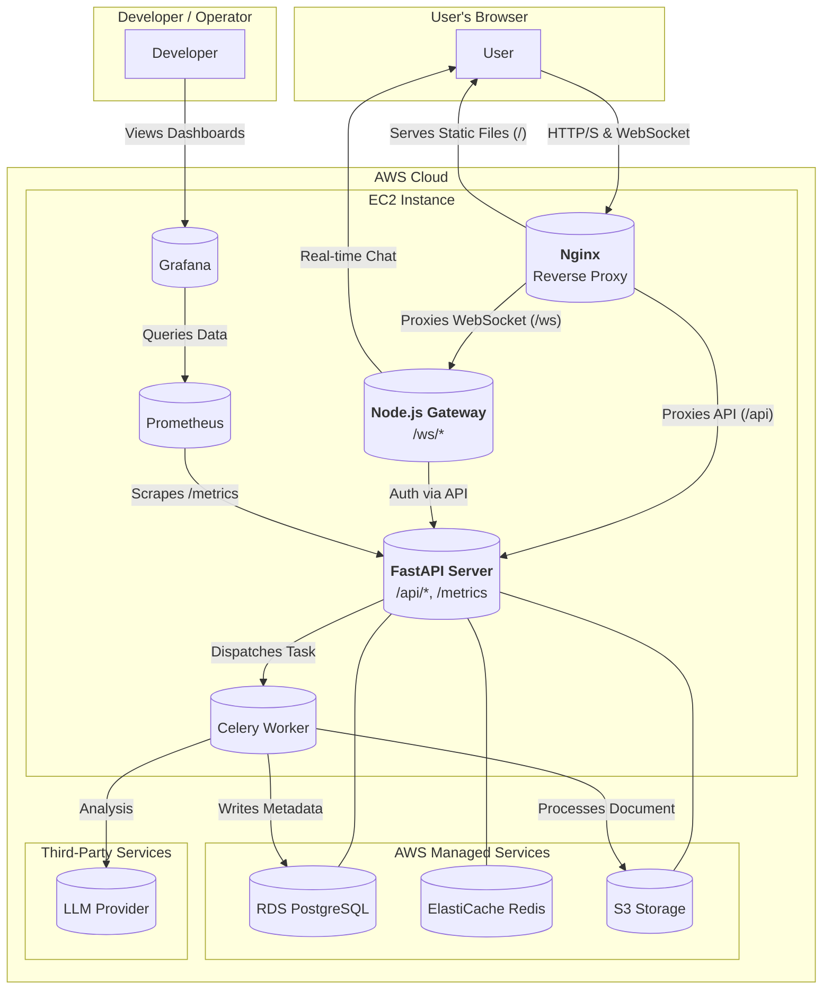
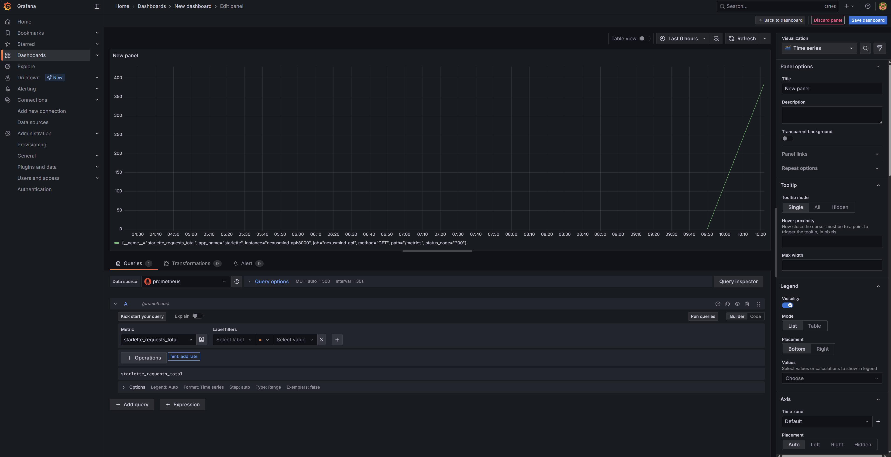

# NEXUSMIND: End-to-End AI Q&A Knowledge Platform

NEXUSMIND is a full-stack, AI-powered knowledge platform built with a modern microservices architecture. It combines the robust data processing and machine learning capabilities of Python (FastAPI, Celery) with the high-concurrency I/O handling of Node.js (Express), providing a seamless and real-time user experience via a React frontend.

The entire application is containerized with Docker and orchestrated via Nginx, making it easy to deploy, scale, and maintain.

## ✨ Core Features

-   **🧠 End-to-End RAG Pipeline**: Implements a complete Retrieval-Augmented Generation pipeline from scratch for accurate, context-aware Q&A.
-   **⚡️ Real-Time WebSocket Chat**: Experience true real-time, streaming responses from the LLM, handled by a dedicated Node.js WebSocket gateway.
-   **🚀 High-Performance Asynchronous Architecture**: Decouples all heavy I/O operations (document parsing, vectorization) using Celery and Redis, ensuring the API remains highly responsive.
-   **📊 Built-in Observability**: Exposes key performance metrics via a `/metrics` endpoint, ready for scraping by the included **Prometheus** & **Grafana** monitoring stack.
-   **🐳 Fully Containerized**: All services (FastAPI, Node.js, React, Celery, Nginx) are containerized with Docker for one-command startup and consistent environments.
-   **☁️ Cloud-Ready & Production-Grade**: Designed for production deployment on AWS, leveraging managed services like RDS and ElastiCache to ensure high availability and scalability.
-   **🔐 Secure & API-Driven**: All functionalities are exposed through a secure, API-key-protected RESTful API.

## 🏛️ System Architecture



## 🛠️ Tech Stack

-   **Backend**: Python, FastAPI, Celery
-   **Frontend**: React, TypeScript, Vite, Material-UI (MUI)
-   **Gateway**: Node.js, Express.js, Socket.IO
-   **Databases & Caching**: PostgreSQL (SQLAlchemy), Redis, Faiss (Vector Store)
-   **AI & NLP**: Retrieval-Augmented Generation (RAG), LangChain, Hugging Face Transformers
-   **Infrastructure & Monitoring**: Docker, Docker Compose, Nginx, Prometheus, Grafana, CI/CD (GitHub Actions)
-   **Cloud**: AWS (EC2, S3, RDS, ElastiCache)

## 🚀 Getting Started: One-Command Launch

This project is designed for a simple, one-command startup using Docker Compose.

### Prerequisites

-   [Docker](https://www.docker.com/) & [Docker Compose](https://docs.docker.com/compose/)

### 1. Clone the Repository

```bash
git clone https://github.com/XinhaoZh23/NexusMind.git
cd NexusMind
```

### 2. Create Your Environment File

Create a `.env` file in the project root directory. You can copy the example file to get started:

```bash
cp .env.example .env
```

Now, open the `.env` file and fill in the required values:
-   `OPENAI_API_KEY`: Your API key for the LLM provider.
-   `API_KEYS`: A secret key (or multiple keys) you will use to grant access to the application's API.
-   Other database and storage settings (for local Docker setup, the defaults in `.env.example` usually work).

### 3. Build and Run with Docker Compose

From the project root, run the following command:

```bash
docker-compose up --build -d
```

This command will:
1.  Build the Docker images for all services.
2.  Start all services in the background.
3.  Set up the necessary network connections between them.

### 4. Access the Application

Once all services are up and running (which may take a few minutes on the first launch), you can access the full application by navigating to:

**`http://localhost`**

That's it! The Nginx container serves the React frontend and correctly routes all API and WebSocket traffic to the appropriate backend services.

## 📖 How to Use

1.  **Open the Web UI**: Navigate to `http://localhost`.
2.  **Create a Brain**: Think of a "Brain" as a dedicated knowledge space. Give it a name and description.
3.  **Upload a Document**: Select the Brain you just created and upload a document (`.txt`, `.pdf`, etc.). The system will process it asynchronously.
4.  **Start Chatting**: Once the document is processed, you can start asking questions related to its content. You will see the LLM's response streamed back to you in real-time.

## 📈 Monitoring & Observability

This project includes a pre-configured monitoring stack using Prometheus and Grafana.

To launch the monitoring services, run the following command from the project root:
```bash
docker-compose -f docker-compose.yml -f docker-compose.monitoring.yml up --build -d
```

Once started, you can access the Grafana dashboard at **`http://localhost:3000`** (default login: `admin`/`admin`). It has been pre-configured with a Prometheus data source.

You can create dashboards to visualize key application metrics, such as API request rates, latency, and error counts, similar to the one below:




## 📁 Project Structure

```
.
├── .github/workflows/      # CI/CD pipeline configuration
├── assets/images/          # Shared images and assets for documentation
├── frontend/               # React (TypeScript) frontend application
├── nginx/                  # Nginx configuration files
├── src/nexusmind/          # Python backend (FastAPI, Celery, RAG Core)
├── tests/                  # Backend tests
├── websocket_gateway/      # Node.js (Express) WebSocket gateway
├── .dockerignore           # Specifies files to ignore in Docker builds
├── .gitignore
├── docker-compose.yml      # Docker Compose for local development
└── README.md
```
